# Spike-dog
Robotic dog with social functions made with Lego Spike.
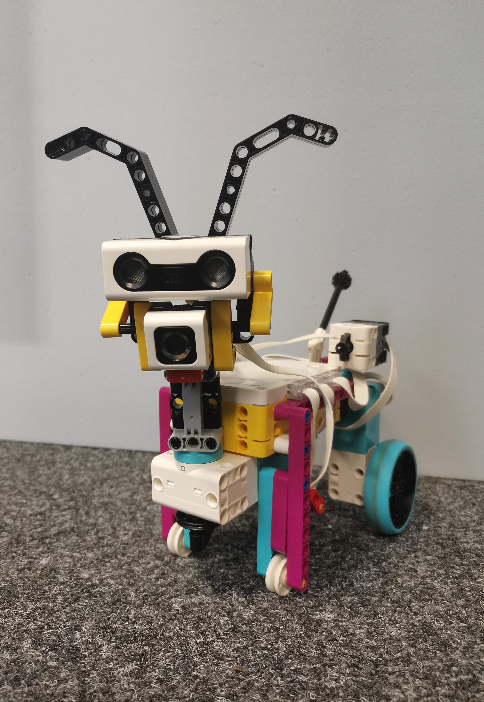
## What is this? 
We build a robotic dog with a focus on social interaction. It can move freely around the room and avoids obstacles. It also shows different reactions to different colors. When it sees yellow, it "greets" you by wagging its head and tail and barking happily. On magenta, it stops, barks and sounds the alarm. At the touch of a button, it starts the "heel" function, in which it moves at a defined distance from a person/object. 
In the following you can see a video with the functions and the code will be explained later. 

## Our idea and its development
At the beginning we wanted to develop a robotic dog that improves your security at home by patrolling your house and alarming you. To scare off strangers, he should also be able to stand up and bark. 
We built the first prototype, which consisted of two wheels, two motors, a large plate. It was able to move around and bark at the colour red. You can see the prototype in the following picture. 
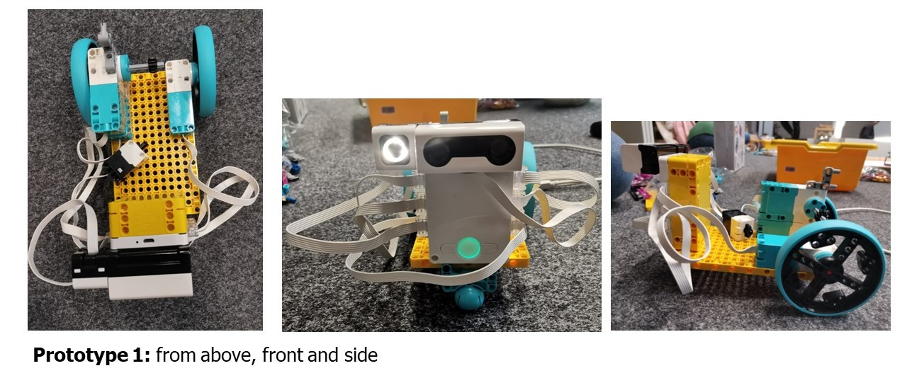

We chose this idea, because we wanted to provide safety without putting a living being in danger. But while building we decided that we wanted to focus more on the social aspect of human-machine- interaction. That's why we switched our project goal: Our robotic dog should be able to interact with you and foster the relashionship by looking cute and approachable.

In the following we will guide you through the process of building and programming our robotic dog. We will also exlain why we choose the design and functions. 

## Installation & Prerequisites
1. Get the [LEGO® Education SPIKE™ Prime-Set](https://education.lego.com/de-de/products/lego-education-spike-prime-set/45678/) to build your roboter. 
2. Download the [LEGO® Education SPIKE™ App](https://education.lego.com/de-de/downloads/spike-app/software/) to your computer. Choose the right version for your operating system.   

## Building our Spike Dog
Our design was based on a [YouTube video](https://www.youtube.com/watch?v=efhQDqzQOD4) that we found. After comparing different examples we choose this design, because it fitted our requirements the most: 
1. The design is quite realistic: It has dog-like features like ears or greeting you with a wagging tail. Because of the familiarity with the most typical features with a real dog the interaction threshold is lower compared to other designs. 
2. The positioning of the distance sensor and its look tries to imitate the eyes of a puppy. This works as a easy non-verbal communication tool.
3. The size of the robot is intentionally small, compact and robust. This makes it easy to carry the robot around and play with it.

In the following we will guide you through the building process: 

### Building the robot
In the following picture you can see all the material that you need to build the Spike Dog. 
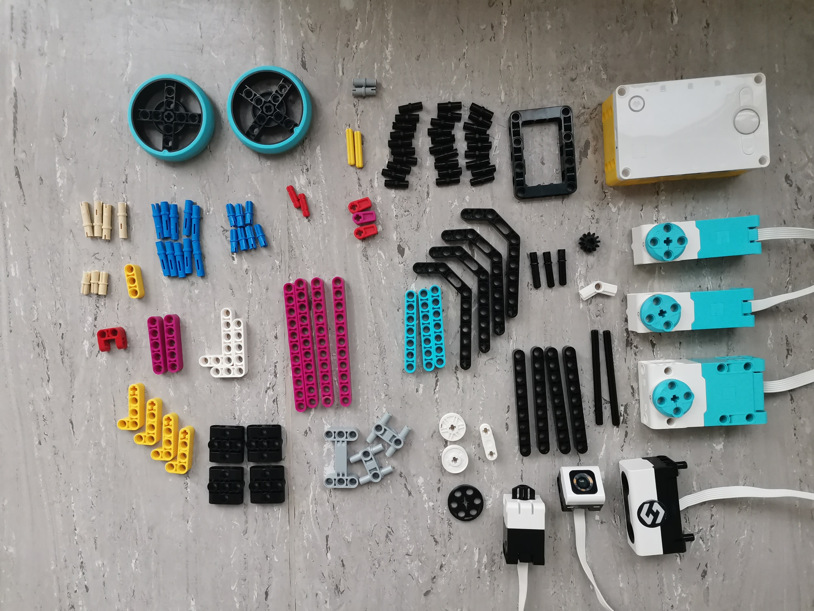

The building process is captured in the video below. Moreover, below the video two explosion pictures depicting the placement of the parts (excluding the pins) from two different angles can be found. These images were made using the CAD application [“LeoCAD”](https://www.leocad.org/ ). If you decide to download this application, a complete robot replication (excluding the pins) and the explosion view of the robot for LeoCAD are provided in the file you can find on top.  

In case you do not want to download this application, you can find stark reductionistic representations of the two files below. These can be opened via the standard 3dViewer but do not display colors.

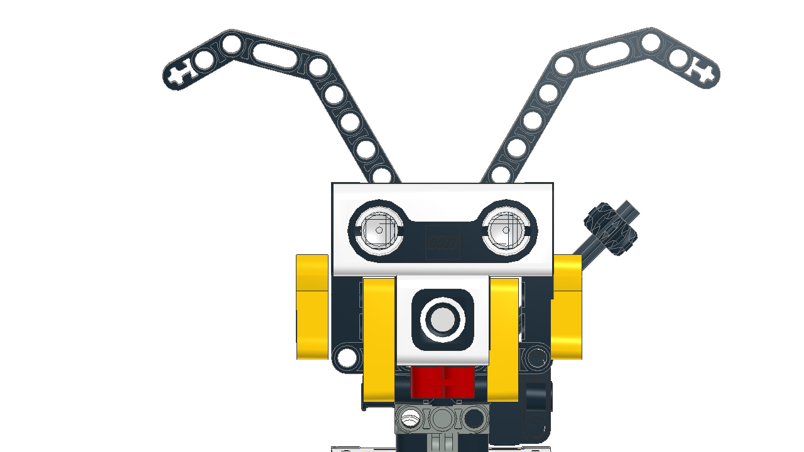
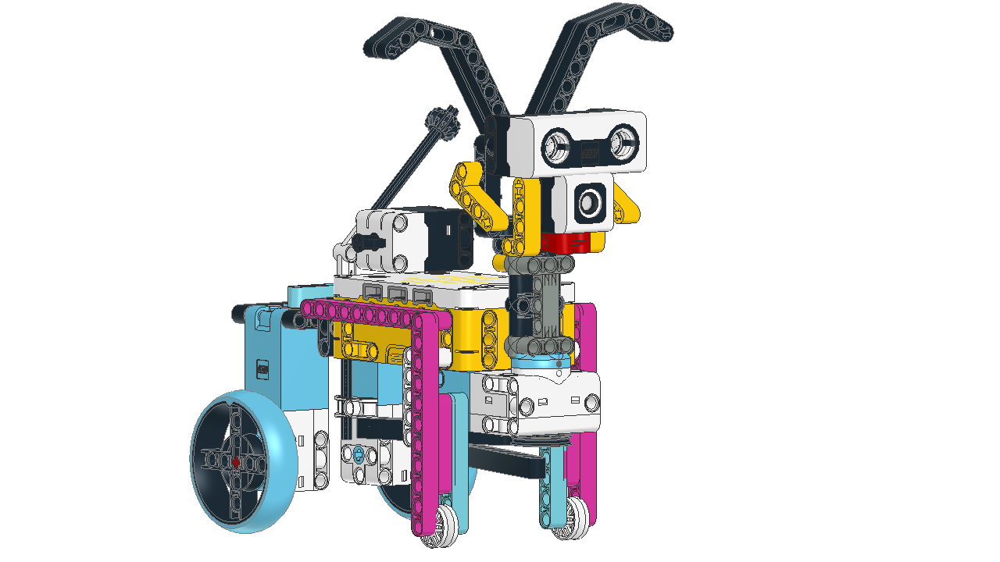
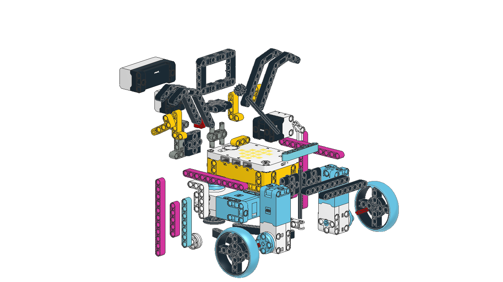

## Programming our Spike Dog
To program our Spike dog we used the *Lego Spike App* and its programming user interface. After opening the App you will see a variety of tutorials and example projects. We recommend the *"First steps"-Tutorial* because it will introduce you to the most important components and commands in a short time and its fun. 

To start your own project, click on the button *"New project"*. If you want to use a already existing project you can find it by clicking on *"my projects"* in the menu on the left. Give your project a name and choose your programming language. In the *Spike App* you can choose between symbol bricks, text bricks ot python. Please choose *text bricks* to follow this tutorial. 

Now you are in coding mode. 

Follow the instructions to connect your PC to the Hub. If you connect sensors to the Hub, you will also see their output on the top menu. On the left you can see a menu with different types of bricks. Chose them by clicking and move them around by drag-n-drop. 

### What are text bricks? 
Text bricks are pieces of code that you can edit and merge to write your program. The shape of the bricks indicates where it should be positioned. There are different types of bricks: *motors, movement, light, sound, events, control, sensors, operators, variables* and your *own bricks*. Instead of explaining every brick we recommend you to try them out and compare the different outcomes. 

Here you can see all of our code. In the following we will show our code in detail and explain what each code block does. We will start with simple movement, before we define the features and then we will put it all together at the end. If you want to test individual code blocks in the meantime we suggest to open another project file and test it there. 
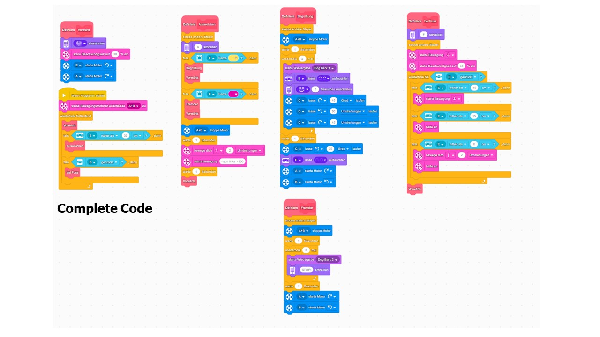

### The Movement block
First, you want the Spike dog to start moving. To structure our code, we used the *define brick* from *your own bricks* and gave it a simple name like *"Vorwärts"*. The purple block makes the diplay show a heart. This is not neccessary for the movement of the robot, but it is useful to know which part of the code is running on your robot right now. The following three bricks are responsible for the movement: You start the motors for the wheels and set the speed on 30%.
Now your Spike Dog will move forward in a straight light, when you start the program. 

**Please be careful**: Depending on the position of the motors you might need to change the direction of the wheels turning. You can do this by clicking on the arrows in the blue bricks.  

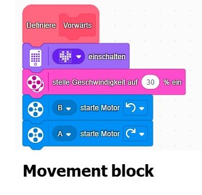

### The Greeting block
Your Spike Dog should be able to recognize you and greet you by wagging it's tail and head. You will use the *colour sensor* for this. To start define a brick again and call it *"Begrüßung"*. First, use the *"stoppe andere Stapel"*-brick to prevent instructions from other blocks from interfering with this process. Then the blue brick stops the movement. After a short pause for one second (yellow brick) you should use a *control brick* to repeat the action two times. The action that should be repeated has to placed inside the control brick. Here, you want the Spike dogs eyes to blink and the display to show a smile. The purple brick starts the barking sound. Then you use a *motor brick* to activate the wagging of the tail and head. Try out different degrees and choose what looks best for you! 

**Please be careful: Watch out which motor you choose here!**

As we said, this action will be repeated twice. After a short pause, we use a *motor brick* again, to make the position of the head straight again. This is important, because the head and eyes are actually our *distance sensor*. If it is not aligned straight forward, it can't work properly and will be prone to malfunctions at other functions. 

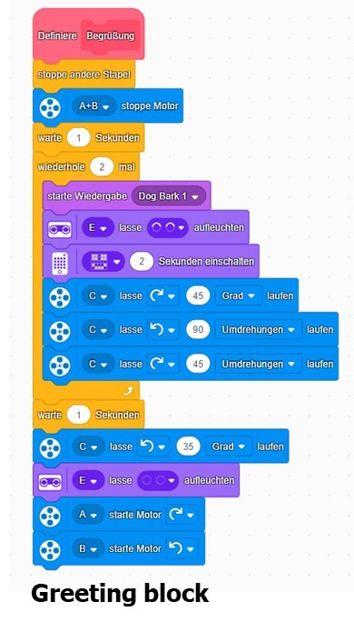

### The Stranger block
You also want to define what happens when your Spike dog recognizes a stranger. Again you should use a *define brick* and stop the other blocks (yellow brick). Just as before, you start by stopping the movement and wait (blue and yellow bricks). Again,you use a *repeat brick*, but now you use a *sound brick* to start the barking sound and a *light brick* to write "STOP!" at the display. 

**Watch out: Click on the sound brick to choose differnt sounds.**

After barking twice and a 1s pause, the Spike Dog will start moving again. 

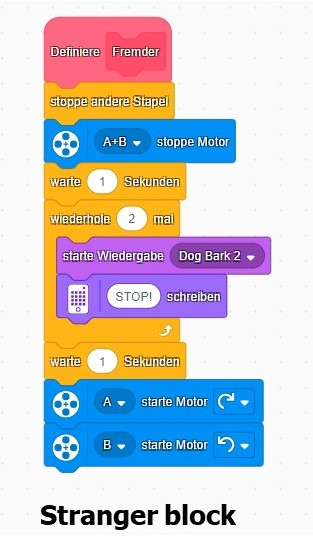

### The Dodge block
Right now, your Spike Dog is able to move forward. You might already know that it will not stop and run into things. With the next function you are going to change this. Again, use a *define* block and stop the actions of other blocks (yellow brick). Then use the purple brick and write an "A" to indicate that Spike Dog is in block *"Ausweichen"*. Now you could us a *control brick* and say "If we detect something close to use, then do this..". This works perfectly fine and you are welcome to try it out!

But we wanted more functionality. That's why we advise to use an *falls-dann control brick*. Under *sensors* you will find the brick that we will us as our condition: "if our colour sensor F will detects a specific colour". Then define, what should happen if that condition appears: It will go to the function blocks you defined earlier. 
Then use the colour yellow to indicate something familiar and start the *Greeting block*. When the sensor detects something magenta it will start the *Stranger block* instead. In both cases it will jump to the *Movement block* afterwards. 

Now continue with the case that the colour sensor doesn't recognize magenta or yellow. Then it will stop all movement and wait for 1s.

**Be careful: Choose both motors to stop the movement completely!**

Then use a *movement brick* to make the wheels turn two times. Use the arrow to choose a backwards diretion. To finish the dodge maneuver use another *movement brick* and start a rotation in any direction. We choose 100 degrees to the left, but you are welcome to change this to your preferences. 

Then after another short break it will start the *Movement block* again. This makes the Spike Dog stop, move backwards and turn after detecting something. Now the Spike Dog is able to take a walk with you and hold a defined distance to you. 

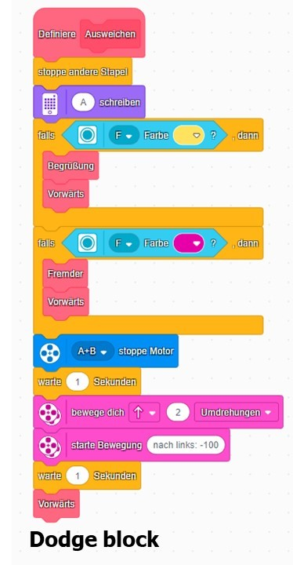

### The Heel block
Right now, Spike Dog is theoretically able to walk forward, dodge things and react to colours. But what if you want to take it for a walk? 
Again start with a *define brick* and stop other blocks. The F ("bei Fuß") will indicate that is in this block. Use two *movement bricks* to start the forward movement and set the speed to 40%. We will explain how the *Heel function* is activated later. For now, just know that it will work, until you press the button (See yellow block *repeat until*). 
Now use three *if..then* bricks for three conditions. 
1. If the Spike dog is farther away than 15cm it starts moving.
2. If the distance is exactly 15cm it will stop moving.
3. And if the distance is shorter than 15cm it will move backwards.

This will be repeated until you push the button. Then the *Movement block* will start again. 

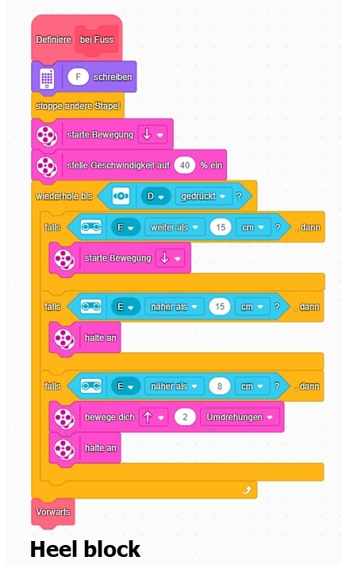

### The Main block
Before, you defined some functions but you weren't able to start them. You will bring everthing together now and code the Main block. Use a "*Wenn Programm startet*" brick first. Then use a *movement brick* to define which motors are responsible for movement in this block. Use a *control brick* to repeat the next bricks continously. 
If everything is normal, the Spike Dog will follow the instructions of the *Movement block*. Now you add conditions: If the *distance sensor* detects something closer than 30cm, it will go to the *Dodge block*. In case the button is pushed, it will go to the *Heel block*. We already introduced those blocks and their funtionalities earlier, so you should be familiar with them already. 

With this your code is finished and your Spike Dog is ready to explore the world. 

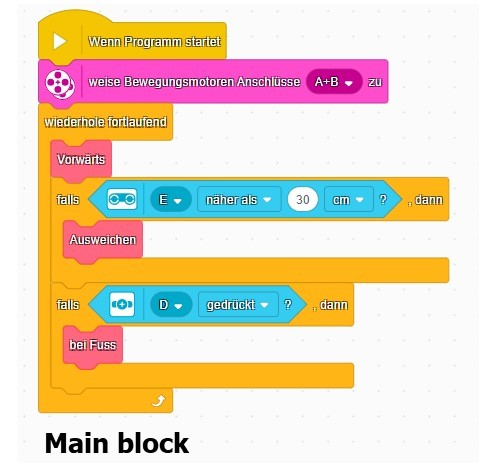

## Lessons learned and future works
We learned a lot about the sensors (distance, color and force sensors). We encountered problems that we learned to deal with. For example, the short distance for the color perception of the color sensor and that the obstacles for the distance sensor cannot be made of any material, as it uses ultrasonic technology (therefore don't use sound-absorbing materials). 

For optimized social human-machine interaction, it's advisable to use an AI camera for better recognition of the environment (especially people) and a microphone for voice commands. However, these aren't included in the [LEGO® Education SPIKE™ Prime-Set](https://education.lego.com/de-de/products/lego-education-spike-prime-set/45678/). With an AI camera, the heel function could possibly not only work in a straight line, as in our case.

Furthermore, the movement could be made more dog-like by replacing the wheels and using joints to represent the legs. 

But we're happy to built a robotic dog with the main focus on social interaction with a few working features. Have fun if you want to build the puppy-like robot :smile:
